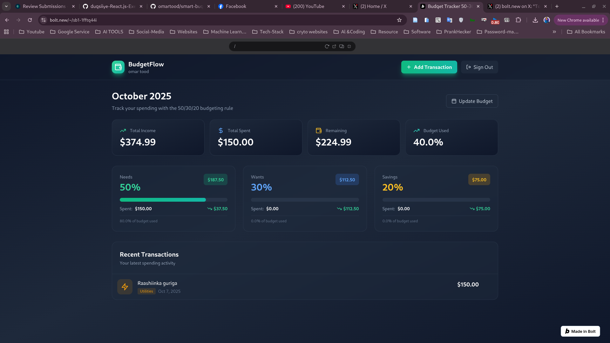

# 💰 BudgetFlow

<div align="center">



**Master Your Money, Achieve Your Goals**

A modern, intelligent budget tracking application built with the proven 50/30/20 budgeting method.

[](https://reactjs.org/)
[](https://www.typescriptlang.org/)
[](https://supabase.com/)
[](https://tailwindcss.com/)

[Features](#-features) • [Demo](#-demo) • [Installation](#-installation) • [Usage](#-usage) • [Tech Stack](#-tech-stack)

</div>

---

## 🌟 Features

### 💵 Smart Budgeting
- **50/30/20 Rule** - Automatically allocate income: 50% Needs, 30% Wants, 20% Savings
- **Custom Budget Rules** - Create your own percentage allocations
- **Monthly Tracking** - Separate budgets for each month with historical data
- **Real-time Updates** - See your budget status update instantly

### 📊 Advanced Analytics
- **Interactive Charts** - Visualize spending with beautiful, responsive charts
- **Category Breakdown** - See spending by category type and individual categories
- **30-Day Trends** - Track your spending patterns over time
- **Smart Insights** - AI-powered recommendations based on your spending habits

### 🔄 Recurring Transactions
- **Automated Tracking** - Set up recurring expenses (subscriptions, bills, etc.)
- **Multiple Frequencies** - Daily, weekly, monthly, or yearly recurrence
- **Auto-Creation** - Optionally auto-create transactions on schedule
- **Easy Management** - Pause, resume, or delete recurring transactions

### 🎯 Savings Goals
- **Goal Tracking** - Set savings targets and track progress visually
- **Deadline Support** - Optional deadlines to keep you motivated
- **Progress Updates** - Add contributions and watch your progress grow
- **Completion Celebrations** - Get rewarded when you achieve your goals

### 🔔 Bill Reminders
- **Payment Tracking** - Never miss a bill payment again
- **Smart Alerts** - Get reminded before bills are due
- **Mark as Paid** - Track payment status easily
- **Recurring Bills** - Set up one-time or recurring bill reminders

### 📥 Data Management
- **CSV Export** - Export transactions and budget summaries
- **Comprehensive Reports** - Generate detailed financial reports
- **Backup Your Data** - Download all your financial data anytime

### 🎨 Beautiful UI/UX
- **Modern Design** - Clean, professional interface with smooth animations
- **Dark Theme** - Easy on the eyes with a sophisticated dark mode
- **Responsive** - Works perfectly on desktop, tablet, and mobile
- **Smooth Animations** - Delightful micro-interactions throughout

### 🔒 Security & Privacy
- **Supabase Backend** - Enterprise-grade security and reliability
- **Row Level Security** - Your data is protected and isolated
- **Encrypted Storage** - All data encrypted at rest and in transit
- **Auth Built-in** - Secure email/password authentication

---

## 🚀 Demo

### Landing Page
Beautiful, conversion-optimized landing page with:
- Animated hero section with parallax effects
- Feature showcase with hover animations
- Social proof and testimonials
- Smooth scroll animations

### Dashboard
Comprehensive financial dashboard featuring:
- Overview of monthly budget status
- Quick access to all features
- Analytics and insights panels
- Transaction management

---

## 📦 Installation

### Prerequisites
- Node.js 18+ and npm
- Supabase account (free tier available)

### Quick Start

1. **Clone the repository**
   ```bash
   git clone https://github.com/yourusername/budgetflow.git
   cd budgetflow
   ```

2. **Install dependencies**
   ```bash
   npm install
   ```

3. **Set up Supabase**
   - Create a new project at [supabase.com](https://supabase.com)
   - Copy your project URL and anon key

4. **Configure environment variables**
   ```bash
   # Create .env file
   VITE_SUPABASE_URL=your_supabase_url
   VITE_SUPABASE_ANON_KEY=your_supabase_anon_key
   ```

5. **Run database migrations**
   - The migrations are in `supabase/migrations/`
   - They will be automatically applied when you connect

6. **Start the development server**
   ```bash
   npm run dev
   ```

7. **Build for production**
   ```bash
   npm run build
   ```

---

## 🎯 Usage

### Getting Started

1. **Create an Account**
   - Sign up with email and password
   - No credit card required

2. **Set Up Your Budget**
   - Enter your monthly income
   - The 50/30/20 rule automatically calculates your budget
   - Or create custom percentage allocations

3. **Add Transactions**
   - Record expenses as they happen
   - Categorize into Needs, Wants, or Savings
   - Track spending against your budget in real-time

4. **Set Up Recurring Expenses**
   - Add subscriptions and regular bills
   - Choose frequency (daily, weekly, monthly, yearly)
   - Enable auto-creation for hands-free tracking

5. **Create Savings Goals**
   - Set target amounts for your financial goals
   - Add optional deadlines
   - Track progress and add contributions

6. **Manage Bill Reminders**
   - Never forget a payment
   - Get reminders before due dates
   - Track payment status

7. **Analyze Your Spending**
   - View interactive charts and graphs
   - Get personalized insights
   - Export data for external analysis

---

## 🛠 Tech Stack

### Frontend
- **React 18** - UI library with hooks
- **TypeScript** - Type-safe JavaScript
- **Vite** - Lightning-fast build tool
- **Tailwind CSS** - Utility-first CSS framework
- **Lucide React** - Beautiful icon library

### Backend
- **Supabase** - Backend-as-a-Service
  - PostgreSQL database
  - Row Level Security (RLS)
  - Real-time subscriptions
  - Built-in authentication

### Architecture
- **Service Layer** - Clean separation of concerns
- **Type Safety** - Full TypeScript coverage
- **Context API** - State management
- **Custom Hooks** - Reusable logic

---

## 📁 Project Structure

```
budgetflow/
├── src/
│   ├── components/        # React components
│   │   ├── Auth.tsx       # Authentication
│   │   ├── LandingPage.tsx
│   │   ├── EnhancedDashboard.tsx
│   │   ├── BudgetSetup.tsx
│   │   ├── AddTransaction.tsx
│   │   ├── SpendingChart.tsx
│   │   ├── InsightsPanel.tsx
│   │   ├── RecurringManager.tsx
│   │   ├── GoalsTracker.tsx
│   │   └── BillsManager.tsx
│   ├── services/          # API service layer
│   │   ├── budgetService.ts
│   │   ├── transactionService.ts
│   │   ├── categoryService.ts
│   │   ├── recurringService.ts
│   │   ├── goalsService.ts
│   │   ├── billService.ts
│   │   └── customRuleService.ts
│   ├── contexts/          # React contexts
│   │   └── AuthContext.tsx
│   ├── utils/             # Utility functions
│   │   ├── analyticsUtils.ts
│   │   └── exportUtils.ts
│   ├── types/             # TypeScript types
│   │   └── index.ts
│   ├── lib/               # Third-party configs
│   │   └── supabase.ts
│   ├── App.tsx            # Main app component
│   └── main.tsx           # Entry point
├── supabase/
│   └── migrations/        # Database migrations
├── public/                # Static assets
└── package.json
```

---

## 🗄 Database Schema

### Core Tables
- **user_profiles** - User information and preferences
- **budgets** - Monthly budget allocations
- **categories** - Spending categories (needs/wants/savings)
- **transactions** - Individual transactions
- **recurring_transactions** - Automated recurring expenses
- **bill_reminders** - Payment reminders
- **savings_goals** - Savings targets and progress
- **custom_budget_rules** - User-defined budget percentages

All tables include:
- Row Level Security (RLS) policies
- Timestamps (created_at, updated_at)
- Foreign key relationships
- Proper indexes for performance

---

## 🎨 Design Philosophy

BudgetFlow follows these design principles:

1. **Simplicity First** - Complex features made simple
2. **Visual Feedback** - Clear indication of actions and states
3. **Performance** - Fast, responsive, and smooth
4. **Accessibility** - Usable by everyone
5. **Mobile-First** - Great experience on all devices

---

## 🚦 Roadmap

- [ ] Multi-currency support
- [ ] Budget templates
- [ ] Shared budgets for families
- [ ] Mobile app (React Native)
- [ ] Bank integration via Plaid
- [ ] Advanced reporting
- [ ] Budget forecasting with ML
- [ ] Dark/Light theme toggle

---

## 🤝 Contributing

Contributions are welcome! Please follow these steps:

1. Fork the repository
2. Create a feature branch (`git checkout -b feature/amazing-feature`)
3. Commit your changes (`git commit -m 'Add amazing feature'`)
4. Push to the branch (`git push origin feature/amazing-feature`)
5. Open a Pull Request

---

## 📝 License

This project is licensed under the MIT License - see the [LICENSE](LICENSE) file for details.

---

## 👨‍💻 Author

**Your Name**
- GitHub: [@yourusername](https://github.com/yourusername)
- LinkedIn: [Your Name](https://linkedin.com/in/yourprofile)

---

## 🙏 Acknowledgments

- Icons by [Lucide](https://lucide.dev/)
- Images from [Pexels](https://pexels.com/)
- Inspired by the 50/30/20 budgeting rule by Elizabeth Warren
- Built with [Supabase](https://supabase.com/)

---

## 📧 Support

Having issues? Feel free to:
- Open an [issue](https://github.com/yourusername/budgetflow/issues)
- Email: support@budgetflow.com
- Discord: [Join our community](https://discord.gg/budgetflow)

---

<div align="center">

**Made with ❤️ by developers who care about financial wellness**

⭐ Star this repo if you found it helpful!

</div>
